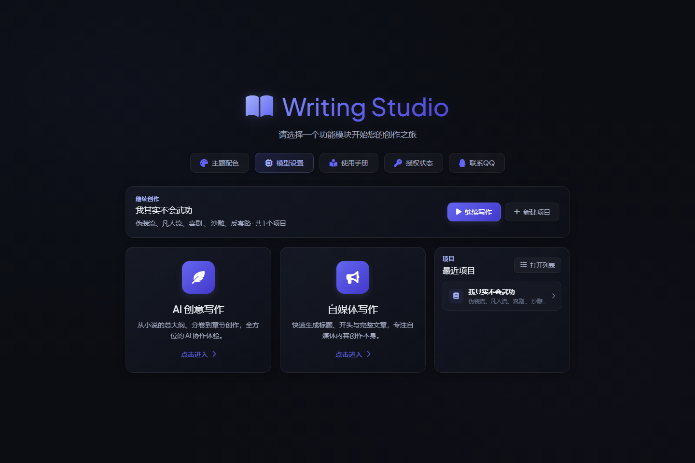
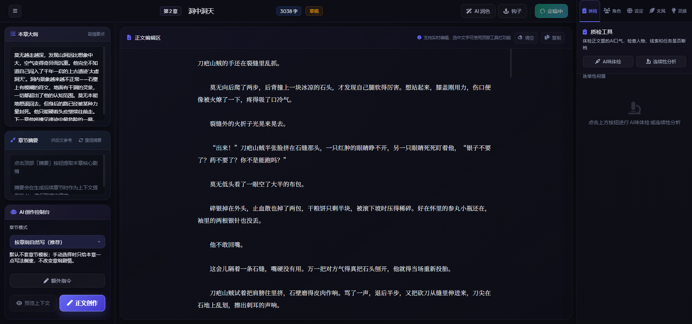
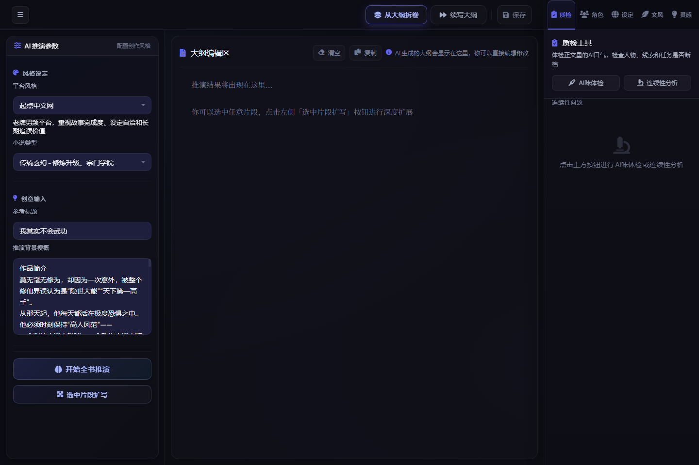
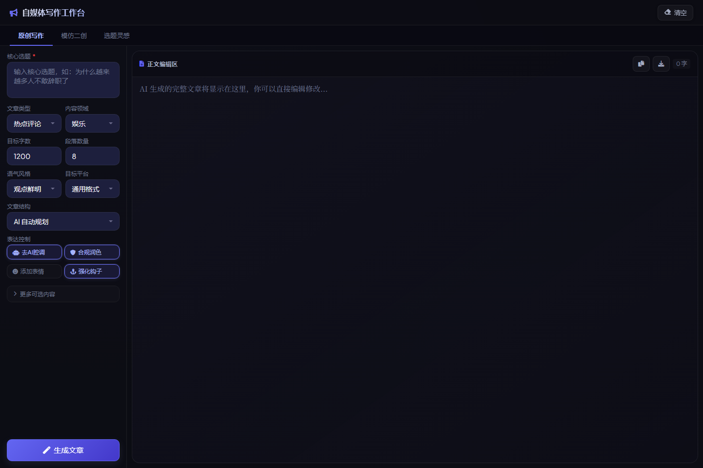

<div align="center">


# WritingStudio

### 面向中文长篇小说的本地 AI 写作工作台

[](https://github.com/lingxiaoyiyu-hub/WritingStudio/releases)
[](LICENSE)
[](#下载安装)
[](https://github.com/lingxiaoyiyu-hub/WritingStudio/releases)
[](https://github.com/lingxiaoyiyu-hub/WritingStudio/releases)
[](https://github.com/lingxiaoyiyu-hub/WritingStudio/issues)
[](https://github.com/lingxiaoyiyu-hub/WritingStudio/stargazers)
[](https://github.com/lingxiaoyiyu-hub/WritingStudio/commits/main)
[](https://github.com/lingxiaoyiyu-hub/WritingStudio/graphs/contributors)
[](https://github.com/lingxiaoyiyu-hub/WritingStudio/discussions)
[](README_EN.md)
[](README.md)

<br>

**大纲推演 · 章节续写 · 角色记忆 · 质检润色 · 钩子爽点 · 自媒体创作**

<br>

把长篇小说写作拆成稳定可控的流程：先做全书大纲，再拆卷、拆章、写正文、定稿、沉淀角色与上下文，尽量让每一章都能接得住前文。

<br>

[📥 下载安装](#下载安装) ·
[✨ 功能特性](#功能特性) ·
[🖼️ 界面预览](#界面预览) ·
[📖 使用流程](#推荐小说写作流程) ·
[📝 更新日志](CHANGELOG.md)

</div>

---

## 📋 目录

- [项目简介](#项目简介)
- [功能特性](#功能特性)
  - [小说创作主线](#小说创作主线)
  - [自媒体与灵感辅助](#自媒体与灵感辅助)
- [界面预览](#界面预览)
- [下载安装](#下载安装)
- [快速开始](#快速开始)
- [推荐小说写作流程](#推荐小说写作流程)
- [常见问题](#常见问题)
- [路线图](#路线图)
- [文档](#文档)
- [反馈与支持](#反馈与支持)
- [贡献](#贡献)
- [许可证](#许可证)

---

## 🌟 项目简介

WritingStudio 不是"一键生成一段文字"的玩具工具，而是为长篇中文小说创作打造的本地 AI 写作工作台。它也支持自媒体文章、选题灵感和内容改写。

核心理念是：**把不可控的灵感写作，变成可拆解、可推进、可沉淀的创作工程。**

> ⚠️ 本仓库仅提供公开发行的安装包与软件说明，**不包含源码**。

---

## ✨ 功能特性

### 📚 小说创作主线

<table>
  <tr>
    <td width="20%"><b>🎯 小说项目管理</b></td>
    <td>创建/管理多个小说项目；按卷、章节组织内容；左侧章节列表快速切换；区分草稿与定稿状态；支持继续写作已有项目</td>
  </tr>
  <tr>
    <td><b>🗺️ 大纲推演</b></td>
    <td>根据故事灵感生成全书大纲；支持续写大纲；支持分卷、分章推进；先搭好主线、阶段目标与剧情走向</td>
  </tr>
  <tr>
    <td><b>✍️ 章节正文创作</b></td>
    <td>按本章大纲生成正文；按章自然续写；支持额外指令临时控制本章写法；预览上下文减少前后文断裂；生成前检查大纲/摘要/定稿完整性</td>
  </tr>
  <tr>
    <td><b>📝 章节摘要与上下文</b></td>
    <td>每章自动生成摘要；摘要作为后续章节上下文参考；避免长篇创作中"每章都从零开始"</td>
  </tr>
  <tr>
    <td><b>👥 角色管理</b></td>
    <td>管理小说角色信息；从正文提取关键人物；记录角色在章节中的经历与变化；维持人物一致性</td>
  </tr>
  <tr>
    <td><b>🎨 AI 润色与定稿</b></td>
    <td>对正文进行 AI 润色；支持章节定稿；定稿后可更新摘要、角色履历与记忆信息；适合"先初稿后打磨"</td>
  </tr>
  <tr>
    <td><b>🪝 钩子与爽点辅助</b></td>
    <td>生成章节钩子；制造悬念、断章点和追读点；专为网文连载场景设计</td>
  </tr>
  <tr>
    <td><b>🔍 质检工具</b></td>
    <td>检测正文 AI 味；检查人物/线索/任务是否断档；连续性分析；发现前后文不连贯</td>
  </tr>
</table>

### 📰 自媒体与灵感辅助

<table>
  <tr>
    <td width="20%"><b>📝 自媒体写作</b></td>
    <td>原创文章生成；模仿二创；选题灵感；可设置文章类型、内容领域、目标字数、语气风格与目标平台</td>
  </tr>
  <tr>
    <td><b>💡 文网与灵感</b></td>
    <td>网文方向创作辅助；灵感生成；适合卡文、缺剧情点、缺设定时使用</td>
  </tr>
</table>

---

## 🖼️ 界面预览

<div align="center">

### 🏠 首页



<br>

### 📖 小说写作工作台



<br>

### ✍️ AI 创意写作



<br>

### 📰 自媒体写作



</div>

---

## 📥 下载安装

### 从 Release 下载

请前往 [Releases 页面](https://github.com/lingxiaoyiyu-hub/WritingStudio/releases) 下载最新版本：

- `WritingStudio_Setup_v3.5.0.exe` —— 一键安装版（推荐，无需解压）
- `WritingStudio_v3.5.0.zip` —— 便携免安装版（解压即用）

### 安装步骤（一键安装版）

1. 下载 `WritingStudio_Setup_v3.5.0.exe`
2. 双击运行，按向导完成安装（无需管理员权限）
3. 从桌面或开始菜单启动 WritingStudio
4. 在**模型配置**中填入自己的模型接口（支持 OpenAI 兼容协议）
5. 回到首页，选择 **AI 创意写作** 或 **自媒体写作** 即可开始

> 💡 **便携版**：下载 `WritingStudio_v3.5.0.zip`，解压到任意文件夹后双击 `WritingStudio.exe` 即可。
>
> 💡 **首次使用建议**：先在模型配置中确认 API Key 与模型名称无误，再开始正式写作。

---

## 🔐 激活与授权

WritingStudio 提供免费试用；如需长期无限制使用，请购买授权套餐：

| 套餐 | 时长 | 价格 |
| :--- | :--- | :--- |
| 7 天体验卡 | 7 天 | ￥38 |
| 月卡 | 30 天 | ￥98 |
| 永久版 | 永久 | ￥188 |

**领取方式**：在软件的激活弹窗中，使用「添加微信」二维码添加开发者，发送你的机器码并付款后领取卡密；也可通过 QQ：574719738 联系。

---

## 🚀 快速开始

1. **启动程序**：双击运行 WritingStudio
2. **配置模型**：进入「模型配置」，填入 API Key 和模型名称
3. **创建项目**：点击「新建小说项目」，输入故事灵感与基础设定
4. **生成大纲**：使用大纲推演功能，生成全书结构
5. **开始写作**：进入章节，生成正文并逐步完善

详细使用指南请参考 [使用文档](docs/usage.md)。

---

## 📖 推荐小说写作流程

```
新建小说项目
    │
    ▼
输入故事灵感与基础设定
    │
    ▼
生成全书大纲 ────────► （可选）续写大纲
    │
    ▼
拆分卷与章节
    │
    ▼
进入章节，补充本章大纲
    │
    ▼
生成正文初稿
    │
    ▼
AI 润色 / 钩子 / 质检 反复打磨
    │
    ▼
确认后点击定稿 ────────► 自动更新摘要、角色履历、记忆
    │
    ▼
继续写下一章
```

---

## ❓ 常见问题

<details>
<summary><b>Q: 支持哪些 AI 模型？</b></summary>
<br>
支持所有 OpenAI 兼容协议的模型，包括但不限于：OpenAI GPT 系列、DeepSeek、智谱 AI、通义千问、月之暗面等。
</details>

<details>
<summary><b>Q: 数据会上传到云端吗？</b></summary>
<br>
不会。WritingStudio 是本地运行的桌面应用，所有小说数据均存储在本地，仅在调用 AI 模型时发送必要的文本内容。
</details>

<details>
<summary><b>Q: 如何备份我的小说项目？</b></summary>
<br>
目前可以通过导出功能备份项目数据。更完善的备份与导出功能正在开发中，详见路线图。
</details>

<details>
<summary><b>Q: 支持哪些操作系统？</b></summary>
<br>
支持 Windows、macOS 和 Linux 三大主流桌面平台。
</details>

更多问题请查看 [FAQ 文档](docs/faq.md) 或在 [Discussions](https://github.com/lingxiaoyiyu-hub/WritingStudio/discussions) 中提问。

---

## 🗺️ 路线图

### ✅ 已完成

- [x] 小说项目管理（卷 / 章）
- [x] 全书大纲推演与续写
- [x] 章节正文生成与续写
- [x] 角色管理与上下文沉淀
- [x] 章节摘要与连续性质检
- [x] 钩子爽点辅助
- [x] 自媒体写作模块

### 🚧 计划中

- [ ] 更多平台风格预设
- [ ] 角色关系图谱可视化
- [ ] 长篇项目数据导出 / 备份

---

## � 文档

| 文档 | 说明 |
| :--- | :--- |
| [使用指南](docs/usage.md) | 详细的功能使用说明和最佳实践 |
| [常见问题 FAQ](docs/faq.md) | 常见问题与解答 |
| [更新日志](CHANGELOG.md) | 各版本变更记录 |
| [安全策略](SECURITY.md) | 安全漏洞报告流程 |
| [支持与帮助](SUPPORT.md) | 获取帮助的方式 |
| [贡献指南](CONTRIBUTING.md) | 如何参与贡献 |
| [行为准则](CODE_OF_CONDUCT.md) | 社区行为规范 |

---

## � 反馈与支持

我们非常重视你的反馈！以下是几种联系方式：

| 类型 | 途径 |
| :--- | :--- |
| 🐛 **Bug 反馈** | 提交 [Issue](https://github.com/lingxiaoyiyu-hub/WritingStudio/issues/new?template=bug_report.yml) |
| 💡 **功能建议** | 提交 [Issue](https://github.com/lingxiaoyiyu-hub/WritingStudio/issues/new?template=feature_request.yml) |
| ❓ **使用提问** | 在 [Discussions](https://github.com/lingxiaoyiyu-hub/WritingStudio/discussions) 中讨论 |
| 🔒 **安全漏洞** | 按 [SECURITY.md](SECURITY.md) 中的流程私下报告 |
| 📝 **更新记录** | 查看 [CHANGELOG.md](CHANGELOG.md) |

---

## 🤝 贡献

欢迎各种形式的贡献！即使这个仓库不包含源码，你仍然可以通过以下方式参与：

- 🐛 提交 Bug 反馈
- 💡 提出功能建议
- 📝 改进文档和翻译
- 🖼️ 提供截图和使用经验
- ❓ 在 Discussions 中帮助回答问题

详细信息请参阅 [贡献指南](CONTRIBUTING.md)。

请在参与前阅读 [行为准则](CODE_OF_CONDUCT.md)。

---

## 📄 许可证

本项目基于 [MIT License](LICENSE) 发布。

本仓库发布的安装包与可执行文件同样遵循 MIT 许可证；源代码暂不公开，但欢迎在 Issue 中交流。

---

<div align="center">

**如果这个项目对你有帮助，欢迎 Star ⭐ 支持一下**

<br>

<a href="https://github.com/lingxiaoyiyu-hub/WritingStudio/stargazers">
  
</a>
&nbsp;
<a href="https://github.com/lingxiaoyiyu-hub/WritingStudio/network/members">
  
</a>
&nbsp;
<a href="https://github.com/lingxiaoyiyu-hub/WritingStudio/watchers">
  
</a>

<br>
<br>

Made with ❤️ for Chinese novel writers

</div>
